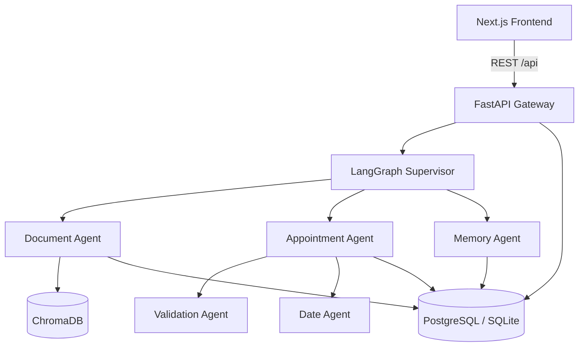
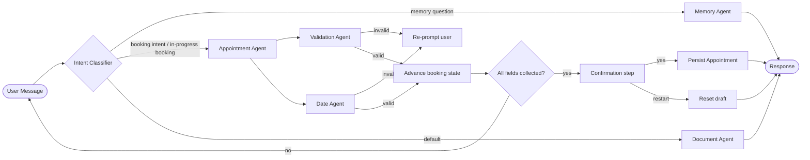
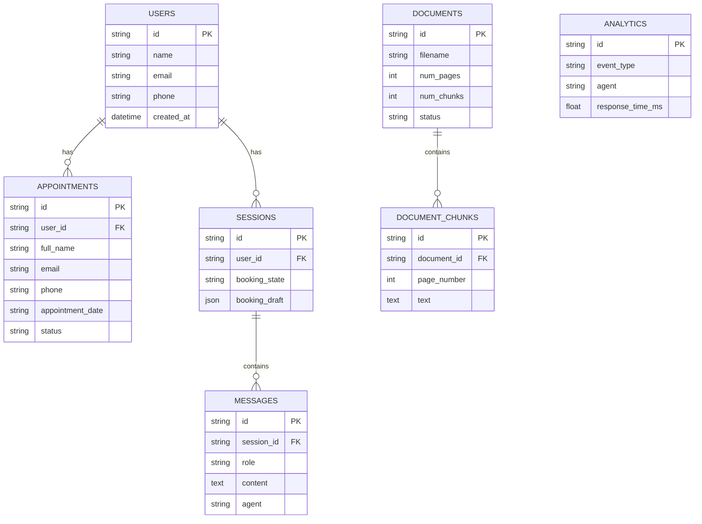
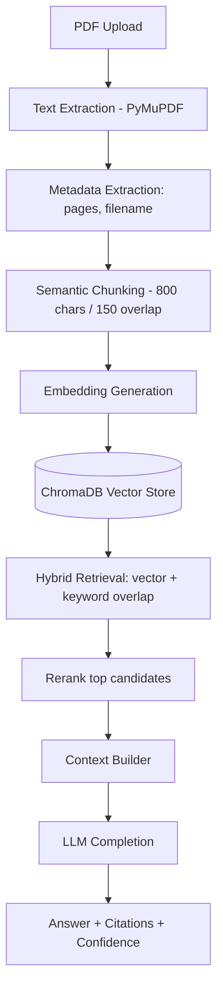
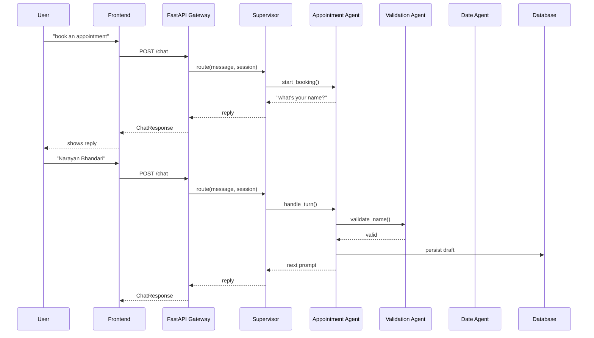

# System Diagrams

## 1. System Architecture

```mermaid
flowchart TD
    A[Next.js Frontend] -->|REST /api| B[FastAPI Gateway]
    B --> C[LangGraph Supervisor]
    C --> D[Document Agent]
    C --> E[Appointment Agent]
    C --> F[Memory Agent]
    E --> G[Validation Agent]
    E --> H[Date Agent]
    D --> I[(ChromaDB)]
    B --> J[(PostgreSQL / SQLite)]
    D --> J
    E --> J
    F --> J
```

## 2. LangGraph Workflow

```mermaid
flowchart LR
    Start([User Message]) --> Router{Intent Classifier}
    Router -->|memory question| Memory[Memory Agent]
    Router -->|booking intent / in-progress booking| Appt[Appointment Agent]
    Router -->|default| Doc[Document Agent]

    Appt --> Validate[Validation Agent]
    Appt --> DateP[Date Agent]
    Validate -->|invalid| Reprompt[Re-prompt user]
    DateP -->|invalid| Reprompt
    Validate -->|valid| NextField[Advance booking state]
    DateP -->|valid| NextField
    NextField --> Confirm{All fields collected?}
    Confirm -->|no| Start
    Confirm -->|yes| Confirmation[Confirmation step]
    Confirmation -->|yes| Booked[Persist Appointment]
    Confirmation -->|restart| Idle[Reset draft]

    Memory --> End([Response])
    Doc --> End
    Booked --> End
    Idle --> End
```

## 3. Database ER Diagram

```mermaid
erDiagram
    USERS ||--o{ APPOINTMENTS : has
    USERS ||--o{ SESSIONS : has
    SESSIONS ||--o{ MESSAGES : contains
    DOCUMENTS ||--o{ DOCUMENT_CHUNKS : contains

    USERS {
        string id PK
        string name
        string email
        string phone
        datetime created_at
    }
    APPOINTMENTS {
        string id PK
        string user_id FK
        string full_name
        string email
        string phone
        string appointment_date
        string status
    }
    DOCUMENTS {
        string id PK
        string filename
        int num_pages
        int num_chunks
        string status
    }
    DOCUMENT_CHUNKS {
        string id PK
        string document_id FK
        int page_number
        text text
    }
    SESSIONS {
        string id PK
        string user_id FK
        string booking_state
        json booking_draft
    }
    MESSAGES {
        string id PK
        string session_id FK
        string role
        text content
        string agent
    }
    ANALYTICS {
        string id PK
        string event_type
        string agent
        float response_time_ms
    }
```

## 4. RAG Pipeline

```mermaid
flowchart TD
    Upload[PDF Upload] --> Extract[Text Extraction - PyMuPDF]
    Extract --> Meta[Metadata Extraction: pages, filename]
    Meta --> Chunk[Semantic Chunking - 800 chars / 150 overlap]
    Chunk --> Embed[Embedding Generation]
    Embed --> Store[(ChromaDB Vector Store)]
    Store --> Retrieve[Hybrid Retrieval: vector + keyword overlap]
    Retrieve --> Rerank[Rerank top candidates]
    Rerank --> Context[Context Builder]
    Context --> LLM[LLM Completion]
    LLM --> Answer[Answer + Citations + Confidence]
```

## 5. Agent Communication Flow

```mermaid
sequenceDiagram
    participant U as User
    participant FE as Frontend
    participant GW as FastAPI Gateway
    participant SV as Supervisor
    participant AP as Appointment Agent
    participant VA as Validation Agent
    participant DA as Date Agent
    participant DB as Database

    U->>FE: "book an appointment"
    FE->>GW: POST /chat
    GW->>SV: route(message, session)
    SV->>AP: start_booking()
    AP-->>SV: "what's your name?"
    SV-->>GW: reply
    GW-->>FE: ChatResponse
    FE-->>U: shows reply

    U->>FE: "Narayan Bhandari"
    FE->>GW: POST /chat
    GW->>SV: route(message, session)
    SV->>AP: handle_turn()
    AP->>VA: validate_name()
    VA-->>AP: valid
    AP->>DB: persist draft
    AP-->>SV: next prompt
    SV-->>GW: reply
    GW-->>FE: ChatResponse
```
